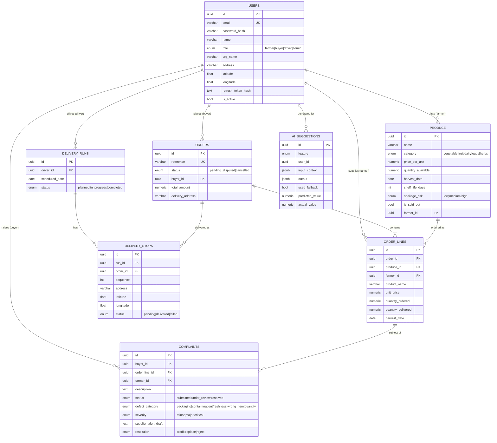

# FreshRoute — System Design Reference

> This is the **factual, code-derived** design reference (ER diagram, API contract,
> component tree, AI architecture). Use it as the backbone for **Deliverable 1**; the
> analysis and rationale prose in the submitted document should be written by the team.

---

## 1. Entity-Relationship Diagram



**Traceability:** each `ORDER_LINE` snapshots `product_name` + `harvest_date` and links to
`produce_id` + `farmer_id`, and `DELIVERY_STOPS` link the order to a run — so any delivered
product traces back to farm, harvest date, and delivery run even if the listing is later edited.

---

## 2. API Contract

Base URL `/api`. All routes except `auth/*` require `Authorization: Bearer <accessToken>`.
Full, live contract with request/response shapes is auto-generated at **`/api/docs`**.

### Auth
| Method | Path | Body | Roles |
|---|---|---|---|
| POST | `/auth/register` | `{email,password,name,role,orgName?,address?}` | public |
| POST | `/auth/login` | `{email,password}` | public |
| POST | `/auth/refresh` | `{refreshToken}` | public |
| POST | `/auth/logout` | — | any |

Returns `{accessToken, refreshToken, user}`.

### Users
| Method | Path | Roles |
|---|---|---|
| GET | `/users/me` · PATCH `/users/me` | any |
| GET | `/users/drivers` · `/users` · `/users/:id` | admin |

### Produce
| Method | Path | Roles |
|---|---|---|
| GET | `/produce/catalogue` | any |
| GET | `/produce/mine` · POST `/produce` · PATCH `/produce/:id` · DELETE `/produce/:id` | farmer |
| GET | `/produce/:id` | any |

### Orders
| Method | Path | Roles |
|---|---|---|
| POST | `/orders` `{lines:[{produceId,quantity}],deliveryAddress?}` | buyer |
| GET | `/orders/mine` | buyer |
| GET | `/orders/incoming` | farmer |
| GET | `/orders` · `/orders/assignable` | admin |
| PATCH | `/orders/:id/status` `{status}` | role-guarded per transition |

### Deliveries
| Method | Path | Roles |
|---|---|---|
| POST | `/deliveries/runs` `{driverId,scheduledDate,orderIds[]}` | admin |
| GET | `/deliveries/runs` | admin |
| GET | `/deliveries/runs/mine` | driver |
| GET | `/deliveries/runs/:id` | driver, admin |
| PATCH | `/deliveries/stops/:id` `{status,failureReason?}` | driver, admin |
| PATCH | `/deliveries/runs/:id/reorder` `{stopIds[]}` | driver, admin |

### Complaints
| Method | Path | Roles |
|---|---|---|
| POST | `/complaints` `{orderLineId,description,manualCategory?}` | buyer |
| GET | `/complaints/mine` | buyer |
| GET | `/complaints/against-me` | farmer |
| GET | `/complaints` · PATCH `/complaints/:id/status` | admin |

### AI (proxy)
| Method | Path | Roles |
|---|---|---|
| GET | `/ai/status` | any |
| GET | `/ai/forecast` | farmer, admin |
| GET | `/ai/pricing/:produceId` | farmer, admin |
| POST | `/ai/classify-complaint` | buyer, admin |
| POST | `/ai/optimise-route` | driver, admin |

### Analytics (admin only)
`/analytics/summary`, `/waste/category`, `/waste/farmer`, `/forecast-accuracy`,
`/pricing-acceptance`, `/top-buyers`, `/driver-success`.

---

## 3. React Component Tree (role visibility)

```
App (Router)
├── /login, /register                         [public]
└── ProtectedRoute → Layout (role-based sidebar + Toasts + socket)
    ├── FARMER
    │   ├── Listings      (CRUD + 💡 AI pricing per row)
    │   ├── Orders        (guarded status advance)
    │   ├── Forecast      (AI demand forecast — Bar chart)
    │   └── Complaints    (complaints against my produce)
    ├── BUYER
    │   ├── Catalogue     (spoilage-highlighted grid + cart → order)
    │   ├── Orders        (status + partial-fulfilment tracking)
    │   └── Complaints    (AI classify + manual fallback)
    ├── DRIVER
    │   └── Deliveries    (Leaflet map + stop updates + AI route optimiser)
    └── ADMIN
        ├── Analytics     (Bar, Pie, Line, horizontal Bar, RadialBar)
        ├── Scheduling    (assign orders → driver runs)
        ├── Complaints    (resolution workflow)
        └── Members       (cooperative directory)
```

Shared: `store/auth` (Zustand, persisted), `store/socket`, `store/notifications`,
`api/client` (Axios with one-shot refresh-token interceptor), `components/ui`.

---

## 4. AI Integration Architecture

```
React (role UI)  ──HTTPS+JWT──▶  NestJS  /api/ai/*  (AiController, role-guarded)
                                     │
                                     ▼
                        AiInsightsService  ── builds context from DB (orders, produce)
                                     │
                                     ▼
                             AiService  ──┬── ANTHROPIC_API_KEY set? ──▶ Anthropic Claude
                                          │                               (system + user prompt,
                                          │                                JSON-only response)
                                          └── unavailable / error ──▶ deterministic fallback
                                     │
                                     ▼
                        persist to ai_suggestions (input, output, used_fallback, model)
```

- **No API key in the frontend.** The proxy is the only holder of `ANTHROPIC_API_KEY`.
- **Structured output:** each prompt demands a single JSON object; the proxy parses and
  coerces enums, clamps pricing to ±25%, and validates the route stop-set server-side.
- **Context management:** compact, structured context (8-week order history for forecasts;
  stock + shelf life + 30-day price history for pricing). Frozen system prompts.
- **Output handling & degradation:** see `docs/AI_INTEGRATION.md`.
